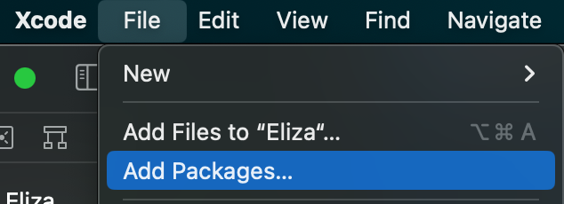
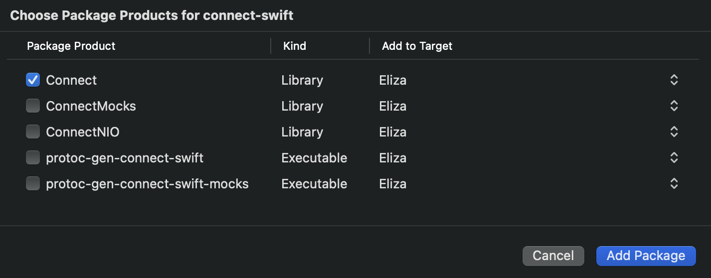

Connect-Swift is a small library (<200KB!) that provides support for using
generated, type-safe, and idiomatic Swift APIs to communicate with your app's
servers using [Protocol Buffers (Protobuf)][protobuf]. It works with the Connect, gRPC, and gRPC-Web protocols.

Imagine a world where you can jump right into building products
and focus on the user experience without needing to handwrite REST/JSON
endpoints or models that conform to `Codable` — instead using generated APIs
that utilize the latest Swift features and are guaranteed to match the server's
modeling. Furthermore, imagine never having to worry about serialization again,
and being able to easily write tests with generated mocks that conform to the
same protocol as the real implementations.
All of this is possible with [Connect-Swift][connect-swift].

In this guide, we'll use Connect-Swift to create a chat app for
[ELIZA](https://en.wikipedia.org/wiki/ELIZA),
a very simple natural language processor built in the 1960s to represent a
psychotherapist. **The ELIZA service is
[implemented using Connect-Go][go-demo], is
[already up and running](https://connectrpc.com/demo) in production, and
supports both the [gRPC-Web][grpc-web] and [Connect](../protocol.md)
protocols - both of which can be used with Connect-Swift for this tutorial.**
The APIs we'll be using are defined in a Protobuf schema that we'll use
to generate a Connect-Swift client.

This tutorial should take ~10 minutes from start to finish.

## Define a Protobuf service

We'll start by creating a Protobuf schema that defines the ELIZA
API. In your shell, create a `.proto` file:

```bash
touch eliza.proto
```

Open the newly created `eliza.proto` file in your editor and add:

```protobuf
syntax = "proto3";

package connectrpc.eliza.v1;

message SayRequest {
    string sentence = 1;
}

message SayResponse {
    string sentence = 1;
}

service ElizaService {
    rpc Say(SayRequest) returns (SayResponse) {}
}
```

This file declares a `connectrpc.eliza.v1` Protobuf package,
a service called `ElizaService`, and a single unary
(single-request / single-response) method
called `Say`. Under the hood, these components will be used to form the path
of the API's HTTP URL.

The file also contains two models, `SayRequest` and `SayResponse`, which
are the input and output for the `Say` RPC method.

## Generate code

We're going to generate our code using [Buf][buf], a modern replacement for
Google's protobuf compiler. Specifically, we will use
[_remote plugins_][remote-plugins],
a feature of the Buf Schema Registry. This requires installing
[Buf's CLI][buf-cli]:

```bash
brew install bufbuild/buf/buf
```

To configure Buf, scaffold a basic [`buf.yaml`][buf.yaml] by running:

```bash
buf mod init
```

Next, tell Buf how to generate code by creating a new
[`buf.gen.yaml`][buf.gen.yaml] file:

```bash
touch buf.gen.yaml
```

...and adding this content to it:

```yaml
version: v1
plugins:
  - plugin: buf.build/bufbuild/connect-swift
    opt: >
      GenerateAsyncMethods=true,
      GenerateCallbackMethods=true,
      Visibility=Public
    out: Generated
  - plugin: buf.build/apple/swift
    opt: Visibility=Public
    out: Generated
```

With those configuration files in place, we can now generate code:

```bash
buf generate
```

In your `Generated` directory, you should now see some generated Swift files:

```
Generated
    ├── eliza.connect.swift
    └── eliza.pb.swift
```

The `.connect.swift` file contains both a Swift protocol interface for the
`ElizaService`, as well as a production client that conforms to this interface.

The `.pb.swift` file was generated by Apple's
[SwiftProtobuf plugin][swift-protobuf] and contains the corresponding Swift
models for the `SayRequest` and `SayResponse` we defined in our Protobuf file.

## Add the `Connect` Swift package

We're ready to create the app that will consume these generated APIs. Open
Xcode and create a new SwiftUI project called `Eliza`.

Next, add a dependency on the `Connect-Swift` package in Xcode by clicking
`File` > `Add Packages...`:



In the popup window, click into the `Search or Enter Package URL` text field
in the top right and paste the Connect-Swift GitHub URL:

```
https://github.com/bufbuild/connect-swift
```

Ensure the `Connect` library is selected, then
click `Add Package` to confirm the package addition. Note that this will
automatically add the required `SwiftProtobuf` package as well:



:::note

If you'd like to use gRPC as the transport protocol, you must also include the
`ConnectNIO` library from the `Connect-Swift` package which provides support
for gRPC by using [SwiftNIO](https://github.com/apple/swift-nio) for trailers.
**This dependency is
not necessary when using the Connect or gRPC-Web protocol.**

:::

### Alternative: Use CocoaPods

CocoaPods is also supported as an alternative to Swift Package Manager.
To use Connect-Swift with CocoaPods, simply add this line to your `Podfile`:

```rb
pod 'Connect-Swift'
pod 'SwiftProtobuf'
```

:::note

Although Connect-Swift provides support for both the Connect and
the gRPC-Web protocols through CocoaPods, gRPC support is only available when
using Swift Package Manager due to the fact that
[SwiftNIO does not support CocoaPods](https://github.com/apple/swift-nio/issues/2393).

:::

## Integrate into the app

First, add the generated `.swift` files from the previous steps to your
project by dragging the `Generated` directory into Xcode.

At this point, your app should build successfully.

To create the chat view, replace the contents of `ContentView.swift` with:

<details><summary>Click to expand <code>ContentView.swift</code></summary>

```swift
import Combine
import SwiftUI

struct Message: Identifiable {
    enum Author {
        case eliza
        case user
    }

    typealias ID = UUID // Required for `Identifiable`

    let id = UUID()
    let message: String
    let author: Author
}

final class MessagingViewModel: ObservableObject {
    private let elizaClient: Buf_Connect_Demo_Eliza_V1_ElizaServiceClientInterface

    @MainActor @Published private(set) var messages = [Message]()

    init(elizaClient: Buf_Connect_Demo_Eliza_V1_ElizaServiceClientInterface) {
        self.elizaClient = elizaClient
    }

    func send(_ sentence: String) async {
        let request = Buf_Connect_Demo_Eliza_V1_SayRequest.with { $0.sentence = sentence }
        await self.addMessage(Message(message: sentence, author: .user))

        let response = await self.elizaClient.say(request: request, headers: [:])
        await self.addMessage(Message(
            message: response.message?.sentence ?? "No response", author: .eliza
        ))
    }

    @MainActor
    private func addMessage(_ message: Message) {
        self.messages.append(message)
    }
}

struct ContentView: View {
    @State private var currentMessage = ""
    @ObservedObject private var viewModel: MessagingViewModel

    init(viewModel: MessagingViewModel) {
        self.viewModel = viewModel
    }

    var body: some View {
        VStack {
            ScrollViewReader { listView in
                // ScrollViewReader crashes in iOS 16 with ListView:
                // https://developer.apple.com/forums/thread/712510
                // Using ScrollView + ForEach as a workaround.
                ScrollView {
                    ForEach(self.viewModel.messages) { message in
                        VStack {
                            switch message.author {
                            case .user:
                                HStack {
                                    Spacer()
                                    Text("You")
                                        .foregroundColor(.gray)
                                        .fontWeight(.semibold)
                                }
                                HStack {
                                    Spacer()
                                    Text(message.message)
                                        .multilineTextAlignment(.trailing)
                                }
                            case .eliza:
                                HStack {
                                    Text("Eliza")
                                        .foregroundColor(.blue)
                                        .fontWeight(.semibold)
                                    Spacer()
                                }
                                HStack {
                                    Text(message.message)
                                        .multilineTextAlignment(.leading)
                                    Spacer()
                                }
                            }
                        }
                        .id(message.id)
                    }
                }
                .onChange(of: self.viewModel.messages.count) { messageCount in
                    listView.scrollTo(self.viewModel.messages[messageCount - 1].id)
                }
            }

            HStack {
                TextField("Write your message...", text: self.$currentMessage)
                    .onSubmit { self.sendMessage() }
                    .submitLabel(.send)
                Button("Send", action: { self.sendMessage() })
                    .foregroundColor(.blue)
            }
        }
        .padding()
    }

    private func sendMessage() {
        let messageToSend = self.currentMessage
        if messageToSend.isEmpty {
            return
        }

        Task { await self.viewModel.send(messageToSend) }
        self.currentMessage = ""
    }
}
```

</details>

Lastly, replace the contents of `ElizaApp.swift` with:

<details><summary>Click to expand <code>ElizaApp.swift</code></summary>

```swift
import Connect
import SwiftUI

@main
struct ElizaApp: App {
    @State private var client = ProtocolClient(
        httpClient: URLSessionHTTPClient(),
        config: ProtocolClientConfig(
            host: "https://demo.connectrpc.com",
            networkProtocol: .connect, // Or .grpcWeb
            codec: ProtoCodec() // Or JSONCodec()
        )
    )

    var body: some Scene {
        WindowGroup {
            ContentView(viewModel: MessagingViewModel(
                elizaClient: Buf_Connect_Demo_Eliza_V1_ElizaServiceClient(client: self.client)
            ))
        }
    }
}
```

</details>

Build and run the app, and you should be able to chat with Eliza! 🎉

import ElizaChatScreenshot from './eliza-chat-screenshot.png';


## Breaking it down

Let's dive into what some of the code above is doing, particularly regarding
how it is interacting with the Connect library.

### Creating a `ProtocolClient`

First, the `ElizaApp` creates and stores an instance of `ProtocolClient`.
This type is configured with various options specifying which HTTP client should
be used (the default being `URLSession`), how data should be encoded/decoded
(i.e., JSON or Protobuf binary), and which protocol to use (in this case,
the [Connect protocol](../protocol.md)).

If we wanted to use JSON instead of Protobuf and to enable request gzipping,
we'd only need to make a simple 2 line change:

```swift
private var client = ProtocolClient(
    httpClient: URLSessionHTTPClient(),
    config: ProtocolClientConfig(
        host: "https://demo.connectrpc.com",
        networkProtocol: .connect,
        //highlight-next-line
        codec: JSONCodec(),
        //highlight-next-line
        requestCompression: .init(minBytes: 50_000, pool: GzipCompressionPool())
    )
)
```

The HTTP client's behavior can be customized by subclassing
the `URLSessionHTTPClient`, by using the `NIOHTTPClient` from the `ConnectNIO`
library, or by creating a new type that conforms to the `HTTPClientInterface`
protocol and passing it as the `httpClient`. For more customization options,
see the [documentation on using clients](./using-clients.md).

### Using gRPC

If you'd like to use gRPC as the transport protocol in the above example,
simply change the following lines after ensuring you have
[included the `ConnectNIO` library dependency](#add-the-connect-swift-package):

<details><summary>Click to expand</summary>

```swift
//highlight-next-line
import ConnectNIO

...

private var client = ProtocolClient(
    //highlight-next-line
    httpClient: NIOHTTPClient(host: "https://demo.connectrpc.com"),
    config: ProtocolClientConfig(
        host: "https://demo.connectrpc.com",
        //highlight-next-line
        networkProtocol: .grpc,
        codec: JSONCodec(),
        requestCompression: .init(minBytes: 50_000, pool: GzipCompressionPool())
    )
)
```

</details>

### Using the generated code

Take a look at the `MessagingViewModel` class above. It is initialized with an
instance of a type that conforms to
`Buf_Connect_Demo_Eliza_V1_ElizaServiceClientInterface` - the Swift protocol
that was generated from the `ElizaService` Protobuf service definition.
Accepting a protocol, rather than the
generated `Buf_Connect_Demo_Eliza_V1_ElizaServiceClient`
concrete type that conforms to the protocol, allows for injecting mock classes
into the view model for testing. We won't get into mocks and testing here, but
you can check out the [testing docs](testing.md) for details and examples.

Whenever the `send(...)` function is invoked by the SwiftUI view, the
view model creates a `Buf_Connect_Demo_Eliza_V1_SayRequest` and
passes it to the `say(...)`
function on the generated client before awaiting a response from the server.
All of this is done using type-safe generated APIs from the Protobuf
file we wrote earlier.

Although this example uses Swift's async/await APIs, traditional
closures/callbacks can also be generated by Connect-Swift, and opening up the
generated `.connect.swift` file will reveal both interfaces. This behavior
can be [customized using generator options](./generating-code.md).

## More examples

There are more [detailed examples][more-examples] that you can explore within
the Connect-Swift repository on GitHub. These examples demonstrate:

- Using streaming APIs
- Integrating with Swift Package Manager
- Integrating with CocoaPods
- Using the [Connect protocol](../protocol.md)
- Using the [gRPC protocol][grpc]
- Using the [gRPC-Web protocol][grpc-web]

## Using gRPC or gRPC-Web

Connect-Swift supports the [Connect](../protocol.md),
[gRPC][grpc], and [gRPC-Web][grpc-web] protocols.
Instructions for switching between them
can be found [here](./using-clients.md).

We recommend using Connect-Swift over [gRPC-Swift][grpc-swift] even if you're
using the gRPC protocol for a few reasons:

- **Idiomatic, typed APIs.** No more hand-writing REST/JSON endpoints and
  `Codable` conformances. Connect-Swift
  [generates](./using-clients.md#using-generated-clients) idiomatic
  APIs that utilize the latest Swift features such as async/await and
  eliminates the need to worry about serialization.
- **First-class testing support.** Connect-Swift generates both production and
  mock implementations that conform to the same protocol interfaces,
  enabling easy [testability](./testing.md) with minimal handwritten
  boilerplate.
- **Easy-to-use tooling.** Connect-Swift integrates with the Buf CLI,
  enabling remote code generation without having to install and configure
  local dependencies.
- **Flexibility.** Connect-Swift uses `URLSession`. The library provides
  the option to [swap this out](./using-clients.md#http-stack),
  as well as the ability to register custom
  [compression algorithms](./using-clients.md#compression)
  and [interceptors](./interceptors.md).
- **Binary size.** The Connect-Swift library is very small (<200KB)
  and does not require any third party networking dependencies when using
  it with the Connect and gRPC-Web protocols. When using it with gRPC,
  the binary size is a bit bigger (~2.4MB) due to the SwiftNIO dependency
  which is required to support HTTP trailers.

If your backend services are already using gRPC today,
[Envoy provides support][envoy-grpc-bridge]
for converting requests made using the Connect and gRPC-Web protocols to gRPC,
enabling you to use Connect-Swift without the SwiftNIO dependency.

[buf]: https://buf.build/docs/
[buf-cli]: https://buf.build/docs/installation
[buf.gen.yaml]: https://buf.build/docs/configuration/v1/buf-gen-yaml
[buf.yaml]: https://buf.build/docs/configuration/v1/buf-yaml
[connect-go]: https://github.com/connectrpc/connect-go
[connect-swift]: https://github.com/bufbuild/connect-swift
[envoy-grpc-bridge]: https://www.envoyproxy.io/docs/envoy/latest/configuration/http/http_filters/connect_grpc_bridge_filter
[go-demo]: https://github.com/connectrpc/examples-go
[grpc]: https://github.com/grpc/grpc/blob/master/doc/PROTOCOL-HTTP2.md
[grpc-swift]: https://github.com/grpc/grpc-swift
[grpc-web]: https://github.com/grpc/grpc/blob/master/doc/PROTOCOL-WEB.md
[more-examples]: https://github.com/bufbuild/connect-swift/tree/main/Examples
[protobuf]: https://developers.google.com/protocol-buffers
[remote-plugins]: https://buf.build/docs/bsr/remote-plugins/usage
[swift-protobuf]: https://github.com/apple/swift-protobuf
